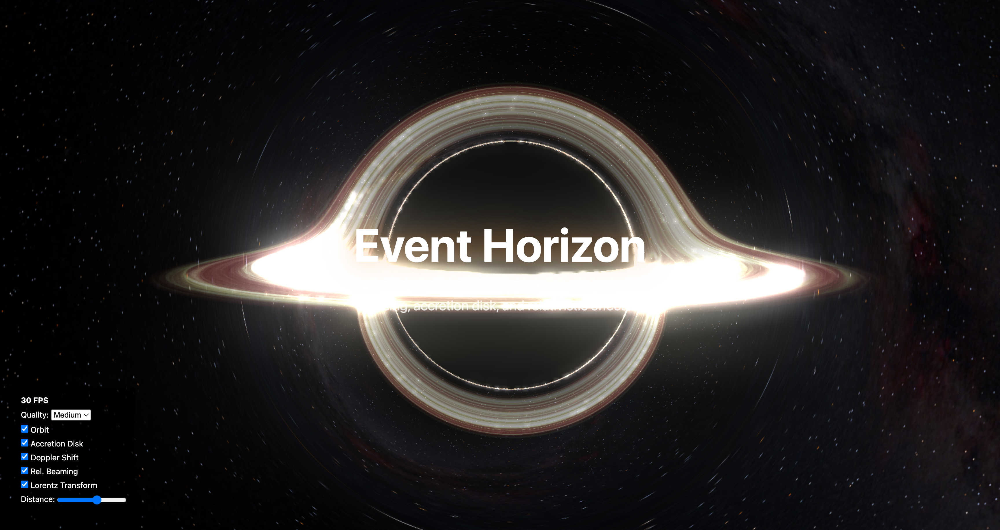

# Blackhole

[](https://www.npmjs.com/package/@junhoyeo/blackhole)
[](https://www.npmjs.com/package/@junhoyeo/blackhole)

Real-time Schwarzschild blackhole visualization demo with gravitational lensing, accretion disk, and relativistic effects.



## Installation

```bash
npm install @junhoyeo/blackhole three
```

## Features

- **Gravitational Lensing**: Ray marching along Schwarzschild geodesics
- **Accretion Disk**: Thin disk model with temperature gradient and texture support
- **Relativistic Doppler Shift**: Color shift based on relative velocity
- **Relativistic Beaming**: Intensity boost from approaching matter
- **Lorentz Transform**: Light aberration from observer motion
- **Orbital Camera**: Stable circular orbit around the black hole
- **Manual Camera Controls**: Mouse/touch drag to rotate view, scroll/pinch to zoom
- **Bloom Effect**: Integrated post-processing for realistic glow
- **React Support**: Drop-in React components

## Usage

### Vanilla Three.js

```typescript
import { BlackholeRenderer } from '@junhoyeo/blackhole';

const renderer = new BlackholeRenderer({
  canvas: document.getElementById('canvas'),
  quality: 'medium',
  cameraDistance: 10,
  fieldOfView: 90,
  enableOrbit: true,
  enableControls: false, // Enable mouse/touch controls
  mouseSensitivity: 0.002,
  touchSensitivity: 0.003,
  enableZoom: true,
  minDistance: 2.1,
  maxDistance: 50,
  showAccretionDisk: true,
  useDiskTexture: true,
  enableLorentzTransform: true,
  enableDopplerShift: true,
  enableBeaming: true,
  bloomStrength: 0.5,
  bloomRadius: 0.3,
  bloomThreshold: 0.8,
  // Optional textures
  backgroundTextureUrl: '/assets/milkyway.jpg',
  starTextureUrl: '/assets/star_noise.png',
  diskTextureUrl: '/assets/accretion_disk.png',
});

renderer.start();
```

### React

#### Basic Background

```tsx
import { BlackholeBackground } from '@junhoyeo/blackhole';

function App() {
  return (
    <div style={{ width: '100vw', height: '100vh' }}>
      <BlackholeBackground
        quality="medium"
        cameraDistance={10}
        enableOrbit={true}
        enableControls={false} // Enable for manual camera control
        backgroundTextureUrl="/assets/milkyway.jpg"
      />
    </div>
  );
}
```

#### Full-screen Section

The package exports a helper `HeroSection` component for easily creating full-screen sections.

```tsx
import { HeroSection } from '@junhoyeo/blackhole';

function LandingPage() {
  return (
    <HeroSection
      blackholeProps={{
        quality: 'high',
        enableOrbit: true,
      }}
    >
      <div className="content">
        <h1>Welcome to the Event Horizon</h1>
        <p>Experience gravity like never before.</p>
      </div>
    </HeroSection>
  );
}
```

### Next.js

For Next.js, use dynamic imports with SSR disabled (the renderer requires browser APIs):

```tsx
import dynamic from 'next/dynamic';

const BlackholeBackground = dynamic(
  () => import('@junhoyeo/blackhole').then((mod) => mod.BlackholeBackground),
  { ssr: false }
);

export default function Page() {
  return (
    <div style={{ width: '100vw', height: '100vh' }}>
      <BlackholeBackground
        quality="medium"
        enableOrbit={true}
        backgroundTextureUrl="/milkyway.jpg"
      />
    </div>
  );
}
```

## Configuration

| Option | Type | Default | Description |
|--------|------|---------|-------------|
| `quality` | `'low' \| 'medium' \| 'high' \| 'ultra'` | `'medium'` | Ray marching quality preset |
| `cameraDistance` | `number` | `10` | Distance from black hole (Schwarzschild radii) |
| `fieldOfView` | `number` | `90` | Camera FOV in degrees |
| `enableOrbit` | `boolean` | `true` | Enable orbital camera motion |
| `orbitSpeed` | `number` | `0.15` | Orbital angular velocity (rad/s) |
| `enableControls` | `boolean` | `false` | Enable manual camera controls (mouse/touch) |
| `mouseSensitivity` | `number` | `0.002` | Mouse sensitivity for camera rotation |
| `touchSensitivity` | `number` | `0.003` | Touch sensitivity for camera rotation |
| `enableZoom` | `boolean` | `true` | Enable camera distance control via scroll/pinch |
| `minDistance` | `number` | `2.1` | Minimum camera distance (Schwarzschild radii) |
| `maxDistance` | `number` | `50` | Maximum camera distance (Schwarzschild radii) |
| `showAccretionDisk` | `boolean` | `true` | Show accretion disk |
| `useDiskTexture` | `boolean` | `true` | Use texture for disk instead of procedural blackbody |
| `enableLorentzTransform` | `boolean` | `true` | Enable light aberration |
| `enableDopplerShift` | `boolean` | `true` | Enable Doppler color shift |
| `enableBeaming` | `boolean` | `true` | Enable relativistic beaming |
| `bloomStrength` | `number` | `0.5` | Bloom post-process strength |
| `bloomRadius` | `number` | `0.3` | Bloom radius |
| `bloomThreshold` | `number` | `0.8` | Bloom threshold |
| `backgroundTextureUrl` | `string` | `""` | URL for background environment map |
| `starTextureUrl` | `string` | `""` | URL for star field data texture |
| `diskTextureUrl` | `string` | `""` | URL for accretion disk texture |
| `resolutionScale` | `number` | `1.0` | Resolution scale factor (0.5 for half res) |

## Development

```bash
git clone https://github.com/junhoyeo/blackhole.git
cd blackhole
npm install
npm run dev
```

## Physics Background

### Schwarzschild Metric

The Schwarzschild solution describes spacetime geometry around a non-rotating, uncharged black hole:

```
ds² = -(1 - rs/r)dt² + (1 - rs/r)⁻¹dr² + r²dΩ²
```

where `rs = 2GM/c²` is the Schwarzschild radius.

### Geodesic Ray Marching

Light follows null geodesics in curved spacetime. The effective potential for photon orbits:

```
V_eff(r) = (1 - rs/r) * L²/r²
```

The photon sphere exists at `r = 1.5 * rs` where light can orbit the black hole.

### Relativistic Effects

- **Doppler Factor**: `δ = 1 / (γ(1 - β·n))` where `β = v/c`
- **Beaming**: Intensity scales as `δ⁴` for isotropic emission
- **Aberration**: Light direction transforms under Lorentz boost

## References

### Papers & Textbooks

1. Schwarzschild, K. (1916). "Über das Gravitationsfeld eines Massenpunktes nach der Einsteinschen Theorie"
2. Luminet, J.-P. (1979). "Image of a spherical black hole with thin accretion disk". Astronomy and Astrophysics, 75, 228-235
3. Misner, C. W., Thorne, K. S., & Wheeler, J. A. (1973). "Gravitation". W. H. Freeman
4. James, O., et al. (2015). "Gravitational lensing by spinning black holes in astrophysics, and in the movie Interstellar". Classical and Quantum Gravity, 32(6)

### Online Resources

- [NASA - Black Hole Visualization](https://svs.gsfc.nasa.gov/13326)
- [Rantonels - Starless](https://github.com/rantonels/starless) - Python black hole raytracer
- [UCLA Galactic Center Group](https://galacticcenter.astro.ucla.edu/)

### Inspiration

This project was inspired by [vlwkaos/threejs-blackhole](https://github.com/vlwkaos/threejs-blackhole). This is a clean-room Apache 2.0 licensed reimplementation based on the same underlying physics (which is public domain knowledge), with independently written code.

## License

Apache License 2.0 - See [LICENSE](./LICENSE) for details.

## Author

[Junho Yeo](https://github.com/junhoyeo)
